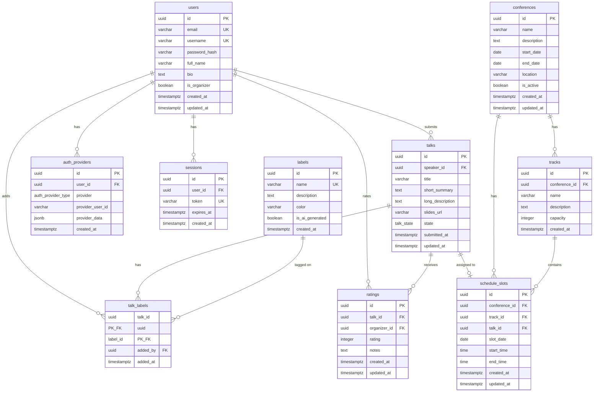

# Call for Papers - Architecture Documentation

This document provides a comprehensive overview of the Call for Papers system architecture, design decisions, and implementation patterns.

## Table of Contents

1. [System Overview](#system-overview)
2. [Technology Stack](#technology-stack)
3. [Architecture Diagrams](#architecture-diagrams)
4. [Frontend Architecture](#frontend-architecture)
5. [Backend Architecture](#backend-architecture)
6. [Database Design](#database-design)
7. [Authentication & Security](#authentication--security)
8. [Code Organization](#code-organization)
9. [Design Decisions](#design-decisions)
10. [Deployment Architecture](#deployment-architecture)

---

## System Overview

The Call for Papers (CFP) system is a self-hosted conference management application that enables speakers to submit talk proposals and organizers to manage the selection and scheduling process.

### Key Characteristics

- **Monolithic Architecture**: Single deployable unit containing frontend and backend
- **Self-Hosted**: Designed for deployment on bare metal or VMs (EC2, etc.)
- **Open Source**: MIT licensed, customizable for any conference
- **Production-Ready**: Includes authentication, authorization, file uploads, email, AI integration

### System Components


### Core Workflows

1. **Speaker Workflow**: Register → Submit Talk → Upload Slides → Respond to Acceptance
2. **Organizer Workflow**: Review Submissions → Rate Talks → Select → Schedule → Communicate
3. **Public Workflow**: View Schedule → Browse Accepted Talks

---

## Technology Stack

### Frontend

**Yew.rs** (Rust WebAssembly Framework)
- **Why Chosen**: Type safety, performance, code sharing with backend
- **Benefits**:
  - Compile-time guarantees reduce runtime errors
  - Single language for full stack (Rust)
  - Near-native performance
  - No JavaScript runtime overhead

**Key Libraries**:
- `yew` - Component framework
- `yew-router` - Client-side routing
- `gloo` - Web API bindings
- `wasm-bindgen` - JavaScript interop
- `web-sys` - Web platform APIs

### Backend

**Rust with Axum** (Web Framework)
- **Why Chosen**: Performance, memory safety, concurrency, ecosystem
- **Benefits**:
  - Zero-cost abstractions
  - Fearless concurrency
  - Memory safety without garbage collection
  - Strong type system prevents entire classes of bugs

**Key Libraries**:
- `axum` - Web framework (built on hyper and tower)
- `tower` - Middleware and service abstractions
- `tokio` - Async runtime
- `sqlx` - Compile-time checked SQL
- `serde` - Serialization/deserialization
- `jsonwebtoken` - JWT authentication
- `argon2` - Password hashing
- `oauth2` - OAuth 2.0 flows
- `lettre` - Email sending
- `reqwest` - HTTP client (for AI APIs)

### Database

**PostgreSQL 12+**
- **Why Chosen**: ACID compliance, rich data types, mature ecosystem
- **Benefits**:
  - JSONB for flexible data storage
  - Full-text search capabilities
  - Robust transaction support
  - Excellent performance and scalability
  - UUID support for distributed systems

### Deployment

- **Native Binary**: Single executable (no JVM, no Node.js)
- **Debian Packages**: Standard Linux package management
- **Docker**: Optional containerized deployment
- **Systemd**: Service management integration

---

## Architecture Diagrams

### C4 Context Diagram


### C4 Container Diagram


### Component Diagram - Backend


---

## Frontend Architecture

### Component Hierarchy

The frontend follows a component-based architecture with Yew.rs:

```
App (Router)
├── AppContent (Authentication State)
│   ├── Header (Navigation)
│   └── Main Content
│       ├── Public Routes
│       │   ├── Home
│       │   ├── Login
│       │   ├── Signup
│       │   ├── AuthCallback
│       │   └── PublicSchedule
│       ├── Protected Routes (ProtectedRoute)
│       │   ├── SubmitTalk
│       │   ├── MyTalks
│       │   └── SpeakerDashboard
│       └── Organizer Routes (OrganizerRoute)
│           ├── OrganizerDashboard
│           ├── OrganizerTalks
│           ├── OrganizerLabels
│           ├── RatingsDashboard
│           ├── ManageTracks
│           ├── ManageScheduleSlots
│           ├── AssignTalks
│           ├── ScheduleBuilder
│           ├── ManageEmailTemplates
│           ├── BulkEmail
│           ├── ExportTalks
│           ├── AIAutoTag
│           └── Configuration
```

### State Management

**Local Component State**: Using `use_state` hook
```rust
let loading = use_state(|| false);
let error = use_state(|| None);
let data = use_state(|| Vec::new());
```

**Authentication State**: Managed at AppContent level
```rust
let is_authenticated = use_state(|| AuthService::is_authenticated());
let is_organizer = use_state(|| AuthService::is_organizer());
```

**Routing State**: Managed by yew-router
```rust
#[derive(Clone, Routable, PartialEq)]
pub enum Route {
    #[at("/")]
    Home,
    #[at("/login")]
    Login,
    // ... more routes
}
```

### Data Flow


### Reusable Components

Located in `frontend/src/components/`:

- **ProtectedRoute**: Ensures user is authenticated
- **OrganizerRoute**: Ensures user is organizer
- **RatingStars**: Displays star ratings
- **RatingForm**: Form to submit ratings
- **LabelBadge**: Displays colored label tags

### Styling

- **CSS**: Traditional CSS files
- **Class-based**: BEM-like naming conventions
- **Responsive**: Mobile-first design
- **Theme**: Configurable colors via config.toml

---

## Backend Architecture

### Layered Architecture

The backend follows a clean layered architecture:

```
┌─────────────────────────────────────┐
│        API Layer (Routes)            │
│  Route definitions, OpenAPI specs    │
└──────────────┬──────────────────────┘
               │
┌──────────────▼──────────────────────┐
│      Middleware Layer                │
│  Auth, CORS, Logging, Rate Limiting  │
└──────────────┬──────────────────────┘
               │
┌──────────────▼──────────────────────┐
│      Handler Layer                   │
│  Request validation, response        │
│  formatting, orchestration           │
└──────────────┬──────────────────────┘
               │
┌──────────────▼──────────────────────┐
│      Service Layer                   │
│  Business logic, external APIs       │
└──────────────┬──────────────────────┘
               │
┌──────────────▼──────────────────────┐
│      Data Layer (Models)             │
│  Database queries, domain models     │
└──────────────┬──────────────────────┘
               │
┌──────────────▼──────────────────────┐
│      PostgreSQL Database             │
└─────────────────────────────────────┘
```

### Request Flow

1. **HTTP Request** arrives at Axum router
2. **Middleware Pipeline** processes request:
   - CORS headers added
   - Request logged
   - Authentication checked (if protected route)
   - Authorization verified (if organizer route)
3. **Handler** executes:
   - Extracts and validates request data
   - Calls service methods if needed
   - Queries database via models
   - Constructs response
4. **Response** sent back to client

### Middleware Pipeline

```rust
// src/api/middleware.rs

// Authentication middleware
pub async fn auth_middleware(
    State(state): State<AppState>,
    mut req: Request<Body>,
    next: Next,
) -> Result<Response, StatusCode> {
    // Extract JWT from Authorization header
    // Validate token
    // Add user info to request extensions
    // Continue to next middleware/handler
}

// Organizer-only middleware
pub async fn organizer_middleware(
    mut req: Request<Body>,
    next: Next,
) -> Result<Response, StatusCode> {
    // Check if user is organizer
    // Return 403 if not
    // Continue to next middleware/handler
}
```

### Handler Pattern

Handlers follow a consistent pattern:

```rust
pub async fn handler_name(
    State(state): State<AppState>,  // Shared app state
    Extension(user): Extension<User>,  // From auth middleware
    Json(payload): Json<RequestType>,  // Request body
) -> Result<Json<ResponseType>, (StatusCode, String)> {
    // 1. Validate input
    // 2. Perform business logic
    // 3. Query/update database
    // 4. Return response
}
```

### Service Layer

Services encapsulate external integrations:

```rust
// src/services/email.rs
pub struct EmailService {
    config: Config,
    db: PgPool,
}

impl EmailService {
    pub async fn send_email(&self, ...) -> Result<()> {
        // Render template
        // Send via SMTP
        // Log to database
    }
}
```

### Application State

```rust
#[derive(Clone)]
pub struct AppState {
    pub db: PgPool,  // Database connection pool
    pub config: Config,  // Application configuration
    pub email_service: EmailService,  // Email sending
    pub claude_service: ClaudeService,  // AI integration
    pub openai_service: OpenAIService,  // AI integration
}
```

---

## Database Design

### Entity Relationship Diagram



### Key Design Decisions

**UUIDs as Primary Keys**:
- Benefits: Distributed ID generation, no coordination needed
- Trade-offs: Slightly larger than INT, but negligible with modern databases

**Enum Types**:
- `talk_state`: Ensures valid states (submitted, pending, accepted, rejected)
- `auth_provider_type`: Type-safe provider identification
- Benefits: Database-level constraints, self-documenting schema

**JSONB for Flexibility**:
- `auth_providers.provider_data`: Stores varying OAuth provider data
- Benefits: Flexible structure, queryable, indexed

**Soft Deletes vs Hard Deletes**:
- Currently using hard deletes (`ON DELETE CASCADE`)
- Future consideration: Add `deleted_at` for audit trail

**Timestamps**:
- `created_at`: Immutable creation timestamp
- `updated_at`: Modified on each update
- Using `TIMESTAMPTZ` for timezone awareness

### Indexes

Strategic indexes for query performance:

```sql
-- User lookup
CREATE INDEX idx_users_email ON users(email);
CREATE INDEX idx_users_username ON users(username);

-- Talk queries
CREATE INDEX idx_talks_speaker_id ON talks(speaker_id);
CREATE INDEX idx_talks_state ON talks(state);
CREATE INDEX idx_talks_submitted_at ON talks(submitted_at);

-- Rating aggregation
CREATE INDEX idx_ratings_talk_id ON ratings(talk_id);
CREATE INDEX idx_ratings_organizer_id ON ratings(organizer_id);

-- Schedule queries
CREATE INDEX idx_schedule_slots_date ON schedule_slots(slot_date, start_time);
CREATE INDEX idx_schedule_slots_talk_id ON schedule_slots(talk_id);
```

---

## Authentication & Security

### Authentication Flow


### OAuth 2.0 Flow


### JWT Structure

```json
{
  "header": {
    "alg": "HS256",
    "typ": "JWT"
  },
  "payload": {
    "sub": "user-uuid",
    "email": "user@example.com",
    "username": "username",
    "is_organizer": false,
    "exp": 1672531200,
    "iat": 1671926400
  },
  "signature": "..."
}
```

### Password Security

- **Algorithm**: Argon2id (winner of Password Hashing Competition)
- **Salt**: Random, unique per user
- **Cost Parameters**: Memory-hard function, resistant to brute-force
- **Storage**: Only hash stored, never plaintext password

```rust
// Password hashing
pub fn hash_password(password: &str) -> Result<String> {
    let salt = SaltString::generate(&mut OsRng);
    let argon2 = Argon2::default();
    let password_hash = argon2
        .hash_password(password.as_bytes(), &salt)?
        .to_string();
    Ok(password_hash)
}

// Password verification
pub fn verify_password(password: &str, hash: &str) -> Result<()> {
    let parsed_hash = PasswordHash::new(hash)?;
    Argon2::default().verify_password(password.as_bytes(), &parsed_hash)?;
    Ok(())
}
```

### Authorization Levels

1. **Public**: No authentication required
   - Home page, schedule view, login/signup

2. **Authenticated**: Valid JWT required
   - Submit talk, view my talks, speaker dashboard

3. **Organizer**: Authenticated + `is_organizer` flag
   - Review talks, rate, manage labels, schedule building

### Security Headers

```rust
// CORS configuration
let cors = CorsLayer::new()
    .allow_origin(Any)
    .allow_methods([Method::GET, Method::POST, Method::PUT, Method::DELETE])
    .allow_headers([AUTHORIZATION, CONTENT_TYPE]);

// Rate limiting (via Envoy proxy in production)
// - 100 requests per minute per IP for authenticated endpoints
// - 20 requests per minute per IP for auth endpoints
```

### File Upload Security

```rust
// Validate file type
const ALLOWED_EXTENSIONS: &[&str] = &["pdf", "pptx", "key", "odp"];

// Validate file size
const MAX_FILE_SIZE: u64 = 50 * 1024 * 1024; // 50 MB

// Sanitize filename
fn sanitize_filename(filename: &str) -> String {
    filename
        .chars()
        .filter(|c| c.is_alphanumeric() || *c == '.' || *c == '_' || *c == '-')
        .collect()
}

// Store with UUID prefix to prevent conflicts
format!("{}-{}", Uuid::new_v4(), sanitized_name)
```

---

## Code Organization

### Backend Structure

```
src/
├── main.rs                 # Entry point, server setup
├── lib.rs                  # Library exports
├── api/
│   ├── mod.rs             # Router setup, route definitions
│   └── middleware.rs      # Auth, CORS, logging middleware
├── handlers/
│   ├── mod.rs             # Handler exports
│   ├── auth.rs            # Login, register, OAuth callbacks
│   ├── talks.rs           # Talk CRUD, state changes
│   ├── labels.rs          # Label management
│   ├── ratings.rs         # Rating CRUD, statistics
│   ├── dashboard.rs       # Dashboard statistics
│   ├── tracks.rs          # Track management
│   ├── schedule_slots.rs  # Schedule slot management, assignments
│   ├── conferences.rs     # Conference management
│   ├── email_templates.rs # Email template CRUD
│   ├── bulk_email.rs      # Bulk email sending
│   ├── export.rs          # Data export (CSV, JSON)
│   ├── ai_tagging.rs      # AI auto-tagging
│   └── config.rs          # Configuration endpoint
├── models/
│   ├── mod.rs             # Model exports
│   ├── user.rs            # User domain model, queries
│   ├── auth.rs            # Auth-related models
│   ├── talk.rs            # Talk domain model, queries
│   ├── label.rs           # Label domain model, queries
│   ├── rating.rs          # Rating domain model, queries
│   ├── track.rs           # Track domain model, queries
│   ├── schedule_slot.rs   # Schedule slot domain model, queries
│   ├── conference.rs      # Conference domain model, queries
│   └── email_template.rs  # Email template domain model, queries
├── services/
│   ├── mod.rs             # Service exports
│   ├── email.rs           # Email service (SMTP, templates)
│   ├── claude.rs          # Claude AI service
│   └── openai.rs          # OpenAI service
├── config/
│   ├── mod.rs             # Config loading, env vars
│   └── models.rs          # Config structs
└── db/
    └── mod.rs             # Database connection setup
```

### Frontend Structure

```
frontend/src/
├── main.rs                # Entry point, WASM initialization
├── app.rs                 # Root component, router setup
├── types.rs               # Shared type definitions
├── components/
│   ├── mod.rs             # Component exports
│   ├── protected_route.rs # Authentication guard
│   ├── organizer_route.rs # Organizer guard
│   ├── rating_stars.rs    # Star rating display
│   ├── rating_form.rs     # Rating submission form
│   └── label_badge.rs     # Label display component
├── pages/
│   ├── mod.rs             # Page exports
│   ├── home.rs            # Landing page
│   ├── login.rs           # Login page
│   ├── signup.rs          # Registration page
│   ├── auth_callback.rs   # OAuth callback handler
│   ├── submit_talk.rs     # Talk submission form
│   ├── my_talks.rs        # Speaker's talks list
│   ├── speaker_dashboard.rs # Speaker dashboard
│   ├── organizer_dashboard.rs # Organizer dashboard
│   ├── organizer_talks.rs # Talk review page
│   ├── organizer_labels.rs # Label management
│   ├── ratings_dashboard.rs # Rating statistics
│   ├── manage_tracks.rs   # Track management
│   ├── manage_schedule_slots.rs # Time slot management
│   ├── assign_talks.rs    # Talk assignment UI
│   ├── schedule_builder.rs # Visual schedule builder
│   ├── public_schedule.rs # Public schedule view
│   ├── manage_email_templates.rs # Template management
│   ├── bulk_email.rs      # Bulk email UI
│   ├── export_talks.rs    # Export UI
│   ├── ai_auto_tag.rs     # AI tagging UI
│   ├── configuration.rs   # Config viewer
│   └── not_found.rs       # 404 page
└── services/
    └── auth.rs            # AuthService for localStorage, token management
```

### Configuration Files

```
project_root/
├── Cargo.toml             # Backend dependencies
├── config.toml            # Runtime configuration (user-created)
├── config.example.toml    # Configuration template
├── config.default.toml    # Embedded default config
├── .env                   # Environment variables (dev)
├── .env.production        # Production env template
├── frontend/
│   ├── Cargo.toml         # Frontend dependencies
│   ├── Trunk.toml         # Frontend build config
│   └── index.html         # HTML shell
├── migrations/            # Database migrations
├── scripts/               # Deployment scripts
├── debian/                # Debian package scripts
└── .github/
    └── workflows/         # CI/CD pipelines
```

---

## Design Decisions

### Why Rust + Yew.rs?

**Performance**:
- Native code generation (no VM overhead)
- Zero-cost abstractions
- Efficient memory usage
- Fast startup time

**Safety**:
- Memory safety without garbage collection
- Thread safety guaranteed by compiler
- No null pointer exceptions
- No data races

**Developer Experience**:
- Single language for full stack
- Shared types between frontend and backend
- Excellent error messages
- Strong ecosystem

**Trade-offs**:
- Smaller community than JavaScript frameworks
- Steeper learning curve
- Longer compile times
- Limited ecosystem for some use cases

### Monolithic vs Microservices

**Chosen: Monolithic**

**Rationale**:
- Simpler deployment (single binary)
- Lower operational overhead
- Easier to reason about
- Sufficient for conference-scale workloads
- Can split later if needed

**Trade-offs**:
- All components scale together
- Single point of failure (mitigated by load balancing)
- Longer build times as codebase grows

### PostgreSQL vs Other Databases

**Chosen: PostgreSQL**

**Rationale**:
- ACID guarantees for critical data (talk states, ratings)
- Rich data types (JSONB, ENUM, UUID)
- Full-text search capabilities
- Mature, proven technology
- Excellent performance characteristics
- Strong community support

**Alternatives Considered**:
- SQLite: Too limited for multi-user web app
- MySQL: Less advanced features than PostgreSQL
- MongoDB: Schema flexibility not needed, ACID important
- Redis: Not suitable as primary database

### State Management (Frontend)

**Chosen: Local component state with hooks**

**Rationale**:
- Sufficient for current complexity
- Simple mental model
- No additional dependencies
- Leverages Yew's built-in hooks

**When to reconsider**:
- If state sharing between distant components becomes complex
- If state persistence needs become more sophisticated
- Consider: `yew-agent` for shared state or Redux-like pattern

### Authentication: JWT vs Sessions

**Chosen: JWT (JSON Web Tokens)**

**Rationale**:
- Stateless (no server-side session storage)
- Scales horizontally easily
- Works well with CDN/proxy caching
- Standard format, wide support

**Trade-offs**:
- Cannot revoke tokens before expiry (workaround: short expiry + refresh)
- Slightly larger than session IDs
- Payload visible (but signed)

**Future Enhancement**:
- Add refresh tokens for long-lived sessions
- Implement token revocation list for security

### File Storage: Filesystem vs S3

**Chosen: Local Filesystem**

**Rationale**:
- Simple deployment
- No external dependencies
- Lower cost for small-medium deployments
- Fast access (local disk)

**Migration Path**:
- Abstract behind interface in `models/talk.rs`
- Can switch to S3 later without handler changes
- Consider S3 when:
  - Multiple app servers need shared storage
  - Total file size exceeds local disk capacity
  - Geographic distribution needed

### Email: SMTP vs Transactional Service

**Chosen: SMTP (with option for external services)**

**Rationale**:
- Maximum flexibility
- No vendor lock-in
- Works with self-hosted mail servers
- Compatible with all SMTP services (SendGrid, Mailgun, SES)

**Configuration**:
- Direct SMTP for self-hosted deployments
- Transactional service for cloud deployments
- Template rendering handled in-app for consistency

---

## Deployment Architecture

### Single Server Deployment


**Characteristics**:
- Simple, cost-effective
- Suitable for small-medium conferences (< 10,000 submissions)
- Single point of failure (acceptable for most use cases)
- Easy to backup and restore

### Multi-Server Deployment (Future)


**Enhancements for Scale**:
- Load balancer distributes requests
- Multiple app servers for redundancy
- PostgreSQL replication for read scaling
- S3 for shared file storage
- Redis for session/cache layer (optional)

### Docker Compose Deployment

```yaml
services:
  postgres:
    image: postgres:15
    volumes:
      - postgres_data:/var/lib/postgresql/data

  backend:
    image: ghcr.io/txlf/call-for-papers:latest
    depends_on:
      - postgres
    environment:
      - DATABASE_URL=postgres://...
      - JWT_SECRET=...

  envoy:
    image: envoyproxy/envoy:v1.28
    ports:
      - "80:8080"
      - "443:8443"
    volumes:
      - ./envoy.yaml:/etc/envoy/envoy.yaml
```

### Monitoring & Observability

**Logging**:
- Structured logging with `tracing` crate
- JSON format for easy parsing
- Log levels: ERROR, WARN, INFO, DEBUG, TRACE
- Outputs to: stdout (collected by systemd/Docker)

**Metrics** (via Envoy):
- Request rate
- Response times (p50, p90, p99)
- Error rates (4xx, 5xx)
- Connection pool stats

**Health Checks**:
- `/api/health` - Basic liveness check
- `/api/health/db` - Database connectivity check
- Used by: Systemd, Docker, load balancers

**Alerting Recommendations**:
- Database connection failures
- High error rates (> 1%)
- Slow response times (> 1s p99)
- Disk space < 20%

---

## Appendix: Key Patterns

### Error Handling Pattern

```rust
// Custom error types
#[derive(Debug, thiserror::Error)]
pub enum AppError {
    #[error("Database error: {0}")]
    Database(#[from] sqlx::Error),

    #[error("Authentication failed")]
    Unauthorized,

    #[error("Not found: {0}")]
    NotFound(String),
}

// Convert to HTTP responses
impl IntoResponse for AppError {
    fn into_response(self) -> Response {
        let (status, message) = match self {
            AppError::Unauthorized => (StatusCode::UNAUTHORIZED, self.to_string()),
            AppError::NotFound(_) => (StatusCode::NOT_FOUND, self.to_string()),
            AppError::Database(_) => (StatusCode::INTERNAL_SERVER_ERROR, "Database error".to_string()),
        };

        (status, Json(json!({"error": message}))).into_response()
    }
}
```

### Database Query Pattern

```rust
// Using sqlx with compile-time checking
pub async fn find_by_id(db: &PgPool, id: Uuid) -> Result<Talk> {
    let talk = sqlx::query_as!(
        Talk,
        r#"
        SELECT id, speaker_id, title, short_summary,
               long_description, slides_url,
               state as "state: TalkState",
               submitted_at, updated_at
        FROM talks
        WHERE id = $1
        "#,
        id
    )
    .fetch_one(db)
    .await?;

    Ok(talk)
}
```

### Async Handler Pattern

```rust
pub async fn create_talk(
    State(state): State<AppState>,
    Extension(user): Extension<User>,
    Json(payload): Json<CreateTalkRequest>,
) -> Result<Json<TalkResponse>, AppError> {
    // Validate
    if payload.title.is_empty() {
        return Err(AppError::Validation("Title required".into()));
    }

    // Insert to database
    let talk = sqlx::query_as!(...)
        .fetch_one(&state.db)
        .await?;

    // Return response
    Ok(Json(TalkResponse::from(talk)))
}
```

---

## Further Reading

- **[API Documentation](api.md)** - Complete REST API reference with examples
- **[DEVELOPMENT.md](../DEVELOPMENT.md)** - Development setup and workflow
- **[DATABASE_SETUP.md](../DATABASE_SETUP.md)** - Database configuration
- **[scripts/README.md](../scripts/README.md)** - Deployment guide
- **[Organizer Guide](organizer-guide.md)** - User guide for organizers
- **[Speaker Guide](speaker-guide.md)** - User guide for speakers

---

**Last Updated**: December 2025
**Version**: 1.0
**Maintained by**: TXLF Contributors
